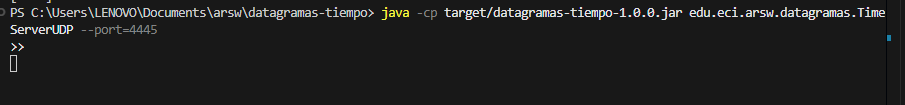
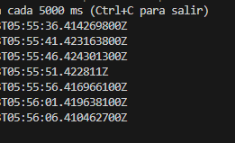

# datagramas-tiempo

## David Santiago Castro

### Funcionalidad general
– Se implementa un servicio de “hora por datagrama” basado en UDP: un servidor responde la hora actual ante cualquier datagrama recibido y un cliente la consulta de forma periódica (cada 5 segundos por defecto).
– El cliente es tolerante a fallas: si durante un intento no llega respuesta dentro de un tiempo razonable (timeout), conserva y sigue mostrando la última hora válida obtenida. Cuando el servidor vuelve a estar disponible, el cliente se “recupera” automáticamente y actualiza la hora.
– La comunicación es sin conexión (UDP), por lo que no hay establecimiento de sesión ni retransmisiones automáticas; el diseño asume posibles pérdidas y las gestiona sin bloquear la interfaz ni detener el proceso.

### Protocolo y formato de mensaje
– Request minimalista: el cliente envía un datagrama corto (un byte es suficiente) para “tocar” al servidor y solicitar la hora.
– Response simple: el servidor responde con la hora actual como cadena de texto legible (por ejemplo, un Instant ISO-8601).
– Codificación: texto plano en UTF-8; tamaño típico de respuesta muy pequeño (<256 bytes), lo que evita fragmentación y facilita la portabilidad.

### Servidor UDP (TimeServerUDP)
– Usa DatagramSocket en un puerto configurable (por defecto 4445) y un bucle de servicio que: recibe datagramas, construye la hora actual y la envía de vuelta a la IP y puerto de origen.
– El servidor no conserva estado entre solicitudes; cada datagrama se procesa de forma independiente y rápida, lo que favorece el rendimiento y la simplicidad.
– Manejo de cierre ordenado: una bandera de ejecución y el cierre del socket permiten detener el bucle limpiamente (importante para pruebas y para apagar el servicio sin dejar recursos colgados).
– Resiliencia básica: si el socket se cierra (SocketException) se sale del bucle sin stack traces innecesarios; la responsabilidad de “reintento” recae en el cliente.

### Cliente UDP (TimeClientUDP)
– Programa orientado a “pull periódico”: agenda consultas cada N milisegundos (5 s por defecto) con un ScheduledExecutorService de un solo hilo, lo que evita solapamientos y condiciones de carrera.
– Por cada ciclo, abre un DatagramSocket efímero, fija un timeout de lectura y envía un datagrama al servidor; si recibe respuesta antes del timeout, reemplaza la “última hora conocida” por la nueva; si no, informa que no hubo actualización y mantiene la anterior.
– Estado interno mínimo pero útil: almacena la última hora válida en un contenedor atómico, de modo que lectura/escritura sea segura y predecible.
– Tolerante a fallos de red: ante DNS caído, servidor apagado, pérdida o retraso de paquetes, el cliente no se bloquea, no lanza excepciones visibles al usuario y no “rompe” su bucle; simplemente informa la falta de actualización y sigue intentando.
– Cierre responsable: al finalizar, detiene de inmediato el ScheduledExecutorService para evitar hilos en fuga y libera recursos de red.

### Consideraciones de diseño
– UDP es apropiado para “lecturas rápidas” y periódicas con tolerancia a pérdidas; se evita la sobrecarga de TCP y su estado de conexión, a cambio de aceptar que algunos ciclos no recibirán respuesta.
– Mantener la “última hora válida” ofrece una experiencia estable incluso con conectividad intermitente; es preferible a mostrar valores vacíos o detener la aplicación ante fallos transitorios.
– El timeout de lectura y el período de sondeo deben balancearse: un timeout muy largo puede solapar ciclos; uno demasiado corto podría marcar falsos negativos en redes con jitter.
– Se prioriza la simplicidad del servidor (stateless, respuesta inmediata) para que escale con muchos clientes “ligeros” que consultan cada pocos segundos.
– La lógica evita dependencias externas y usa únicamente la biblioteca estándar, facilitando su ejecución en entornos restringidos.

### Fiabilidad y rendimiento
– Mensajes pequeños y operaciones O(1) por solicitud minimizan latencias y uso de CPU.
– La estrategia “abrir socket por ciclo” en el cliente simplifica el control de timeout y recursos; alternativamente, podría mantenerse un socket persistente si se busca micro-optimización.
– Al no haber reconocimiento de aplicación, el cliente asume idempotencia: consultas repetidas no impactan negativamente y las respuestas tardías no “rompen” el estado (simplemente se sobreescriben con la última).
– Si se esperaran ráfagas o redes muy ruidosas, puede añadirse un identificador de solicitud simple en el payload para descartar respuestas antiguas fuera de orden, aunque en la práctica con periodos de segundos y paquetes pequeños rara vez es necesario.

### Pruebas y validación
– Se prueban tres escenarios clave: “servidor disponible” (el cliente obtiene y almacena una hora válida), “servidor ausente” (el cliente mantiene la última hora y reporta la falta de actualización) y “servidor vuelve” (el cliente detecta el retorno y actualiza la hora).
– Para pruebas deterministas y rápidas, se reducen el período de sondeo y el timeout; se usan puertos efímeros para evitar colisiones y se controla el ciclo de vida del servidor con banderas.
– Se verifica que no queden hilos ni sockets abiertos tras las pruebas, garantizando que la batería de tests pueda ejecutarse en CI sin flakiness.
– Se comprueba que el cliente no lance excepciones no controladas frente a caídas y que el mensaje “sin actualización, manteniendo última hora” se produzca únicamente cuando corresponde.

### Configuración y operativa
– Parámetros ajustables: dirección/host del servidor, puerto UDP, período entre consultas y timeout de lectura; estos valores permiten adaptar el cliente a redes más lentas o políticas más estrictas de firewall.
– Compatibilidad con entornos de laboratorio: al ser UDP, puede requerir reglas explícitas de firewall para tráfico saliente/entrante en el puerto elegido; en redes NAT típicas no suele haber problema para tráfico saliente desde el cliente.
– Observabilidad básica: se incluyen mensajes informativos en cliente y servidor; es sencillo enriquecerlos con timestamps o niveles de log si se integra un framework de logging más adelante.

### Extensiones posibles
– Añadir verificación de “frescura” con sello temporal enviado por el servidor y validado por el cliente para detectar relojes desalineados.
– Incluir reintentos inmediatos en un mismo ciclo (por ejemplo, dos intentos antes de declarar “sin actualización”) cuando la red sea especialmente ruidosa.
– Ofrecer formatos alternativos de hora (epoch millis, RFC-1123) y negociación sencilla por payload si se necesitara interoperar con otros sistemas.
– Implementar métricas de disponibilidad (porcentaje de ciclos con éxito, tiempo desde la última actualización) para monitoreo en ambientes reales.

## Resultados de Ejecucion

### Ejercicio 3:

Ponemos el siguiente codigo en la terminal del ide, o corremos la clase TimeServerUPD para correr el servidor 

java -cp target/datagramas-tiempo-1.0.0.jar edu.eci.arsw.datagramas.TimeServerUDP --port=4445

Luego corremos TimeClientUDP

java -cp target/datagramas-tiempo-1.0.0.jar edu.eci.arsw.datagramas.TimeClientUDP --host=127.0.0.1 --port=4445 --periodMs=5000 --timeoutMs=1500

